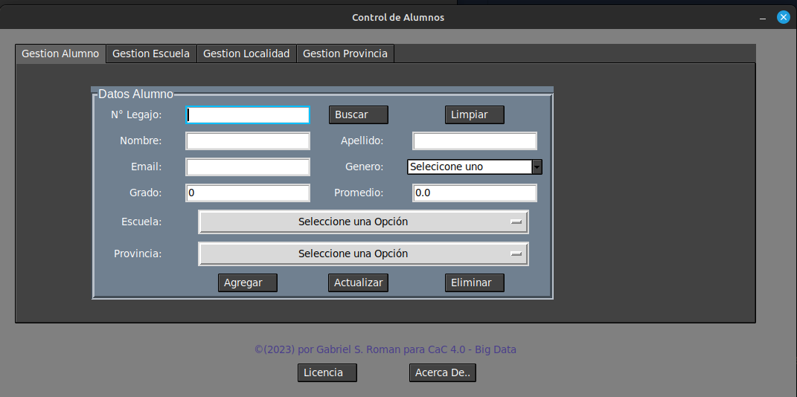
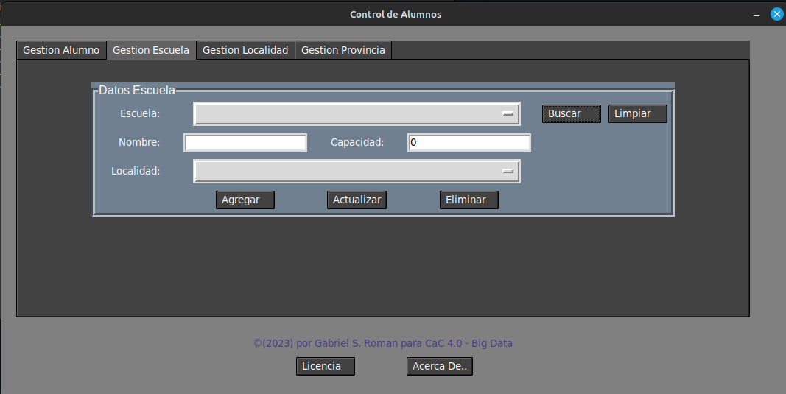
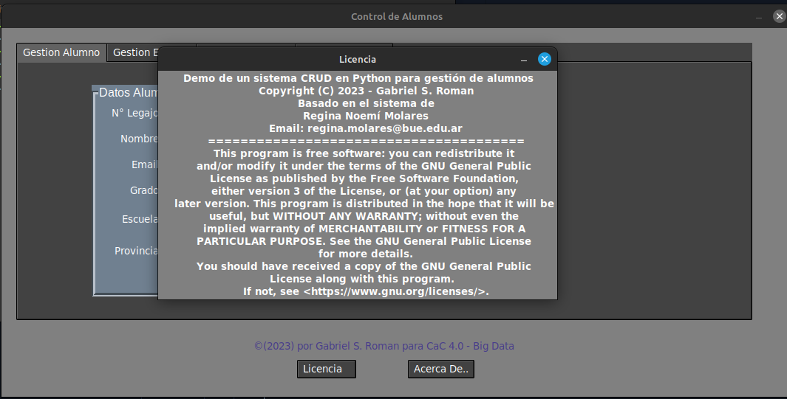
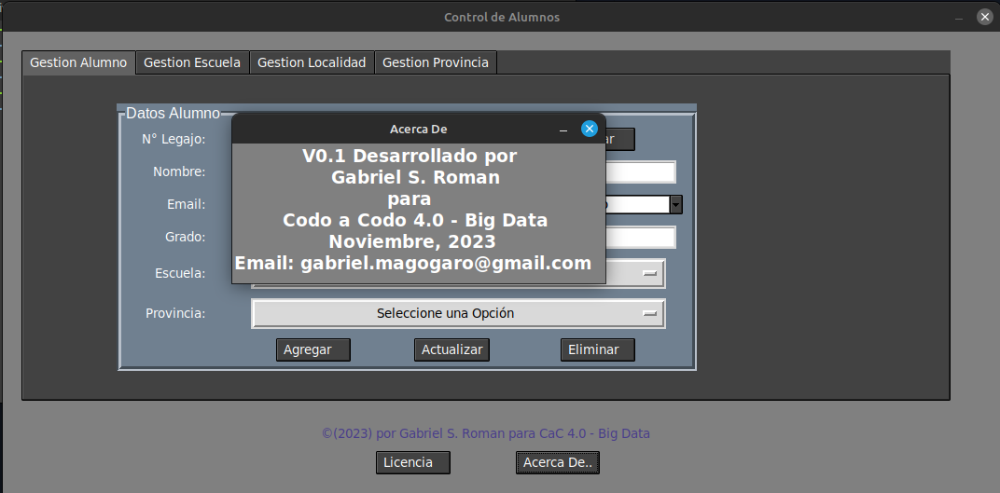

# CRUD_Python_gestion_alumnos_y_escuelas
Pequeño CRUD realizado en Linux Mint 21.2 Victoria con Python, utilizando Tkinter, para gestion de alumnos y escuelas con una base de datos Sqlite

### Recomendaciones:
1. Crear un entorno virtual para no tener problemas con los packequetes  
`python3 -m venv (nombre que le demos)`  
2. Instalar con `pip` los paquetes necesarios  
	`pip install ttkthemes`  

### Imagenes de muestra:

